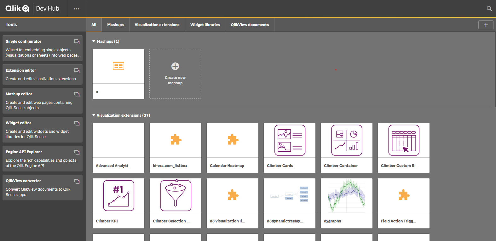
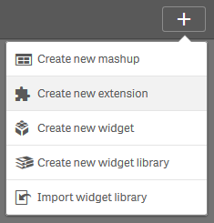
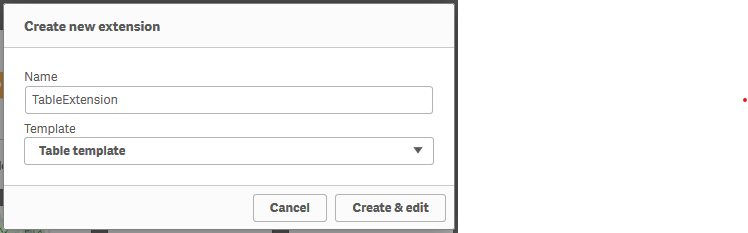

# エクステンションを作成する
Qlik Sense Hubを開き、右上の「…」ボタンから「Dev Hub」をクリックします。  
既定のWebブラウザが起動し、 Dev Hub が開かれます。  

新規エクステンションを作成します。  
右上の「＋」ボタンから「Create new Extension」をクリックします。  
  
エクステンションの名前を入力します。  
テンプレートは「Table template」を選択します。  

一般的なテーブルを集計する機能を持ったエクステンションのテンプレートが作成されます。

このままDev Hub上でエクステンションを編集することもできますが、今後の作業はVisual Studio Code等のエディタで行うことを強くお勧めします。

作成されたエクステンションは`C:\Users\{USERNAME}\Documents\Qlik\Sense\Extensions`に保存されています。

ここまでの作業内容をダウンロード:  
[ダウンロード](https://github.com/ISLdekura/QsExtensionTutorialSite/tree/master/Working_Extension/1_1)