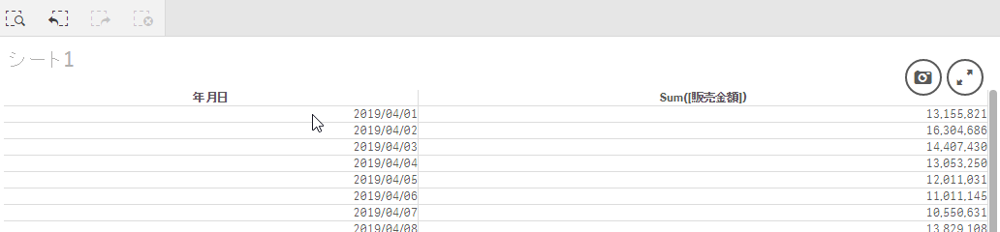

このページで作成するファイルを[ダウンロード](https://github.com/ISLdekura/QsExtensionTutorialSite/tree/master/Working_Extension/1_4)

# 行を選択できるようにする
基本的な説明を終えたところで、[カスタマイズしないで使ってみる](Tutorial1/Use_Default_Extension.md)で問題になっていた箇所を解決してゆきましょう。  
デフォルト状態のエクステンションは次の3点が問題になっていました。

- 軸`年月日`をクリックしても項目が選択されない
- セルの背景色が設定できない
- スタイルが適用されておらず、チャートにおしゃれ感が足りない

まずはテーブルの軸をクリックしたときに行が選択されるように変更しましょう。

## jsファイルの構成
`TableExtension.js`を編集する前に、まずはファイルをざっと眺めてみましょう。  
次の画像はファイルをざっくりと折りたたんだ状態にしたものです。  
このページでは赤枠で囲った `createRows()` と `paint()` 関数の2か所を編集します。


エクステンションが読み込まれる際、2行目にある **`define()`** の引数になっている関数の処理内容が1回だけ実行されます。  
その中で `createRows()` 関数が定義されます。この関数は `paint()` から呼び出されます。  
その後シートを開いたとき、選択状態が変化したときなどに **`paint()`** 関数にある描画処理が呼び出されます。  
Qlik Senseのエクステンション開発では主に上記の2か所を編集することになります。

## 変更内容
JavaScriptから項目を選択したいときはQlik Sense APIを使用します。  
今回使用するのは `backendApi.selectValues(qDimNo, qValues, qToggleMode)`です。
([関数のヘルプ](https://help.qlik.com/en-US/sense-developer/June2019/Subsystems/APIs/Content/Sense_ClientAPIs/BackendAPI/selectvalues-method.htm)) 

変更点は2か所あります。  
最初に、テーブルを作成する時に行番号など選択に必要な情報をHTMLに埋め込んでおきます。  
その後要素にイベントリスナーを追加し、APIを呼び出して選択状態を変更します。

変更点①
`TableExtension.js`にコードを追加します。  
ファイル5行目～の`createRows()`関数に追記します。
```js
	function createRows ( rows, dimensionInfo ) {
		var html = "";
		rows.forEach( function ( row ) {
			html += '<tr>';
			row.forEach( function ( cell, key ) {
				if ( cell.qIsOtherCell ) {
					cell.qText = dimensionInfo[key].othersLabel;
				}
				html += "<td ";
				if ( !isNaN( cell.qNum ) ) {
					html += "class='numeric'";
				}
                // ---------- 追加 ここから ----------
                // HTMLに属性を追加(あとでクリックされたときに値を取りだすため)
				if (cell.qState === "O" || cell.qState === "S"){
					// 列が "O" or "S" のときのみ属性を追加
                    // "O" => option(白状態)
                    // "S" => selected(緑状態) 
                    // "X" => excluded(灰色状態)
                    // "L" => 数式
					html += " qDim ";
					html += " qElemNumber='" + cell.qElemNumber + "' ";
					html += " qDimNumber='" + key + "' ";
				}
                // ---------- 追加 ここまで ----------
				html += '>' + cell.qText + '</td>';
			} );
			html += '</tr>';
		} );
		return html;
	}
```

変更点②
ファイル後半にある`paint()`関数の`return`文直前にクリックされたときの処理を追加します。  
```js
			// ---------- 追加 ここから ----------
			// クリックされたときの処理
			$element.find("td").on("click", function() {
				// 列が軸ではないときは何もしない
				if (!this.hasAttribute("qDim")){
					return
				}

                // セルの背景色を変更する
                this.setAttribute("style", "background-color: #0000ff");

				// パラメータを取得して項目を選択する
				var qDimNumber = parseInt(this.getAttribute("qDimNumber"));
				var qElemNumber = parseInt(this.getAttribute("qElemNumber"));
				self.backendApi.selectValues(qDimNumber, [qElemNumber], true);
			})
			// ---------- 追加 ここまで ----------
			return qlik.Promise.resolve();
```

ファイルの修正が終わったら上書き保存し、Qlik Senseを`F5`で画面をリロードしましょう。  
エクステンションが再読み込みされるとセルをクリックして値を選択することができるようになっています。  
上手くいかない場合は編集する場所を間違えていないか確認し、Qlik Senseを再起動してみてください。  


