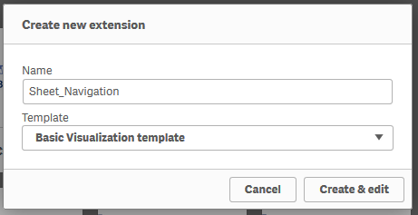
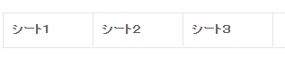

このページで作成するファイルを[ダウンロード](https://github.com/ISLdekura/QsExtensionTutorialSite/tree/master/Working_Extension/2_1)

# シート一覧を表示する
これから作成する「シート一覧を表示する」機能は新規エクステンションとして独立したものにします。  
ブランクのエクステンションを作成しましょう。

Dev Hubから新しいエクステンションを作成します。 


jsファイル内に次の内容を記述します。  
今回は `paint` メソッドは使用しません。  
代わりにQlik Senseに組み込まれたテンプレートエンジンの `AngularJS` を利用しています。  
テンプレートとなるHTMLを `template` に、ロジック部分は `controller`に記述します。  
このように、 `paint` メソッドの代わりに `template` と `controller` を活用することでデザインとロジックを分離し、見通しのよいコードにすることができます。  
もちろん、前の章までのように `paint` メソッドを利用してもよいですが、あらかじめ出力するHTMLの形がある程度予想できる場合にはテンプレートエンジンを利用するとよいでしょう。  
AngularJSについては [AngularJS公式マニュアル](https://angular.io/)も参考にしてください。

以下、サンプルコードです。  
app APIによって取得したシート名とIDの情報をボタンに設定し、それをクリックするとNavigation APIによってシート遷移を行います。  
スタイルはLeonardo uiのTabsetを利用しています。

```js
'use strict';
define( [ "qlik"
],
function (qlik) {
	return {
		support : {
			snapshot: true,
			export: true,
			exportData : false
		},
		template: `
			<div class="">
				<ul class="lui-tabset" style="border: 1px solid rgba(0, 0, 0, 0.1);">
					<li ng-repeat="sheet in sheets track by $index" class="lui-tab">
						<div ng-click="gotoSheet(sheet.id);">
							{{sheet.title}}
						</span>
					</li>
				</ul>
			</div>
		`,
		controller: ['$scope', function( $scope ) {
			$scope.sheets = function(){
				// シートのタイトル・シートIDの一覧を取得する
				const app = qlik.currApp();
				let sheetList = [];
				app.getList("sheet").then(function(result){
					result.layout.qAppObjectList.qItems.forEach(element => {
						let item = {
							title: element.qMeta.title,
							id : element.qInfo.qId
						};
						sheetList.push(item);
					});
				});
				return sheetList;
            }();
            
			$scope.gotoSheet = function(id){
				// IDで指定されたシートに移動する
				qlik.navigation.gotoSheet(id);
			}
		}]
	};
});
```

作成したエクステンションの見た目は以下のようになります。

シート名のテキストをクリックするとそのシートへ移動することができます。
