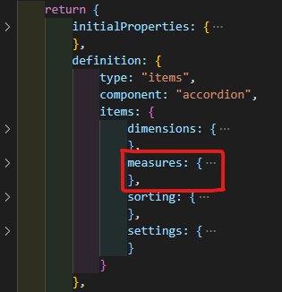
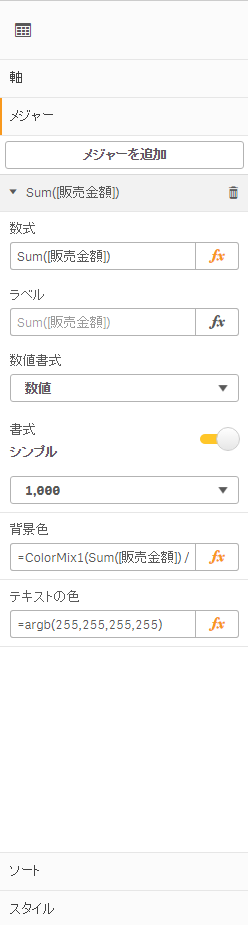
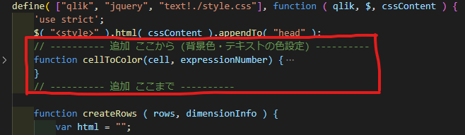
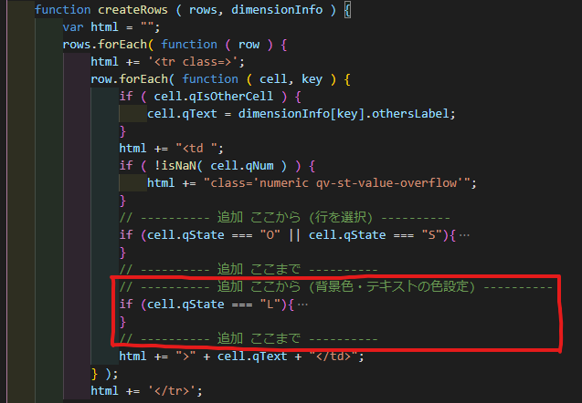
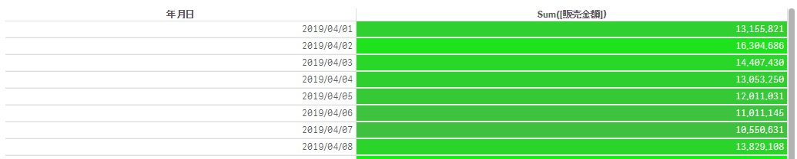

このページで作成するファイルを[ダウンロード](https://github.com/ISLdekura/QsExtensionTutorialSite/tree/master/Working_Extension/1_5)

# 背景色・テキストの色を設定する
軸を選択できるようになったので、残りの問題はあと2つです。

- セルの背景色が設定できない
- スタイルが適用されておらず、チャートにおしゃれ感が足りない

次は背景色を設定できるようにしましょう。

## 変更内容
テーブルの各セルに色をつけるためにはメジャーに色の情報を持たせる必要があります。  
エクステンションの定義に修正を加えることでプロパティを増やすことができます。  
下の図のように`measures`の定義を探し、「背景色」「テキストの色」の設定を加えます。  


```js
				measures: {
					uses: "measures",
					min: 0,
					// ---------- 追加 ここから (背景色・テキストの色設定) ----------
					items: {
						backgroundColor: {
							type: "dual",
							component: 'expression',
							label: "背景色",
							ref: "qAttributeExpressions.0.qExpression",
							expression: "always",
							defaultValue: ""
						},
						textColor: {
							type: "dual",
							component: 'expression',
							label: "テキストの色",
							ref: "qAttributeExpressions.1.qExpression",
							expression: "always",
							defaultValue: ""
						}
					}
					// ---------- 追加 ここまで ----------
				},
```

エクステンション定義にプロパティを追加することで「背景色」「テキストの色」の数式が入力できるようになります。  
色の数式を入力しておきましょう。  
背景色:  `=ColorMix1(Sum([販売金額]) / Max(Total Aggr(Sum([販売金額]),年月日)), RGB(128,128,128), RGB(0,255,0))`  
テキストの色: `=argb(255,255,255,255)`  


プロパティを設定したら、Qlik Senseから受け取った色の情報をDOMのスタイルとして適用するロジックを作成しましょう。  
ロジックの変更箇所は2か所です。  
1か所目の変更点はファイルの先頭付近の関数定義です。
関数`cellToColor()`はセルの情報を受け取り、色の情報を返します。  

```js
define( ["qlik", "jquery", "text!./style.css"], function ( qlik, $, cssContent ) {
	'use strict';
	$( "<style>" ).html( cssContent ).appendTo( "head" );
	// ---------- 追加 ここから (背景色・テキストの色設定) ----------
	function cellToColor(cell, expressionNumber) {
		// expressionNumber
		// => 0: 背景色
		// => 1: テキストの色

		// プロパティが存在するか確認
		if(cell.qAttrExps !== undefined){
			if(cell.qAttrExps.qValues !== undefined){
				if(cell.qAttrExps.qValues[expressionNumber] !== undefined){
					const colorNum = cell.qAttrExps.qValues[expressionNumber].qNum;
					if (isNaN(colorNum)){
						return null;
					}
					// Qlik Senseの色表現はARGB, CSSはRGBAなので順序を変換する
					const argb = ('00000000' + colorNum.toString(16)).slice(-8); // 10進数→16進数、桁数が足りない場合0埋めする
					const a = parseInt(argb.slice(0, 2), 16);
					const r = parseInt(argb.slice(2, 4), 16);
					const g = parseInt(argb.slice(4, 6), 16);
					const b = parseInt(argb.slice(6, 8), 16);
					if(!isNaN(a) && !isNaN(r) && !isNaN(g) && !isNaN(b)){
						return 'rgba(' + r + ',' + g + ',' + b + ',' + a + ')';
					}
				}
			}
		}
		// 色情報が存在しない、もしくはRGB(), ARGB()のフォーマットではない場合nullを返す
		return null;
	}
    // ---------- 追加 ここまで ----------
```

2箇所目は関数`createRows()`内です。  
htmlに色情報を埋め込んでゆきます。  
加えてフォントの変更・適切なマージン設定等の見た目に関する設定も適用します。  
  
```js
                // ---------- 追加 ここから (行を選択) ----------
                if (cell.qState === "O" || cell.qState === "S"){
                    // ... (この行は前ページの修正箇所です) ...
				}
				// ---------- 追加 ここまで ----------
				// ---------- 追加 ここから (背景色・テキストの色設定) ----------
				if (cell.qState === "L"){
					// 列が"L"のときのみスタイルを追加
					html += "style='"

					// セルから色情報を取得
					var backgroundColor = cellToColor(cell, 0);
					var textColor = cellToColor(cell, 1);

					// 背景色を指定
					if (backgroundColor){
						html += "background-color: " + backgroundColor + "; ";
					}

					// テキストの色を指定
					if (textColor){
						html += "color: " + textColor + "; ";
					}

					// style属性の終わり
					html += "' ";
                }
                html += "><div class='qv-st-data-cell ng-scope qv-st-data-cell-dimension-value qv-st-data-cell-numeric'><div class='qv-st-value'><div class='ng-binding ng-scope'>" + cell.qText + '</div></div></div></td>';
				// ---------- 追加 ここまで ----------

				// ---------- 削除 ここから ----------
				// html += '>' + cell.qText + '</td>';
				// ---------- 削除 ここまで ----------
```

以上の変更を加えるとメジャーに設定した背景色・テキストの色がチャートに反映されるようになります。  

