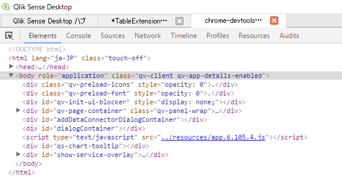
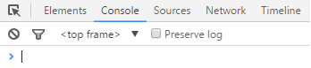
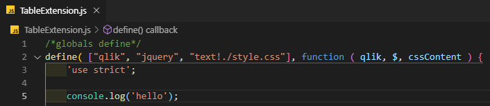
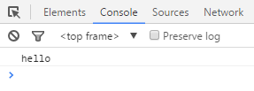

# DevToolsを開く
Qlik Senseの画面表示部分は [Chromium](https://www.chromium.org/) というブラウザで動いています。  
開発者ツール(DevTools)はエクステンションを作っているときに便利な機能が詰まっています。  

DevToolsはQlik Senseの画面を`Ctrl`+`Shift`+`右クリック`で表示されるメニューから開くことができます。  
またはChrome, FireFox等のブラウザで`F12`キーからも開発者ツールを表示できます。  

Qlik Senseのエクステンション開発で主に関わるのはElementsタブとConsoleタブです。  
ElementsタブではHTMLの要素を確認できます。  
  
ConsoleタブではJavaScriptを直接入力したり、エクステンションから出力された表示を確認することができます。  

エクステンションからコンソールに文字を表示してみましょう。  
`TableExtension.js`を開き、関数の先頭部分に1行追加します。  
``console.log('hello')``  
  
ファイルを保存し、Qlik Senseの画面を`F5`でリロードするとコンソールタブに結果が表示されています。  

