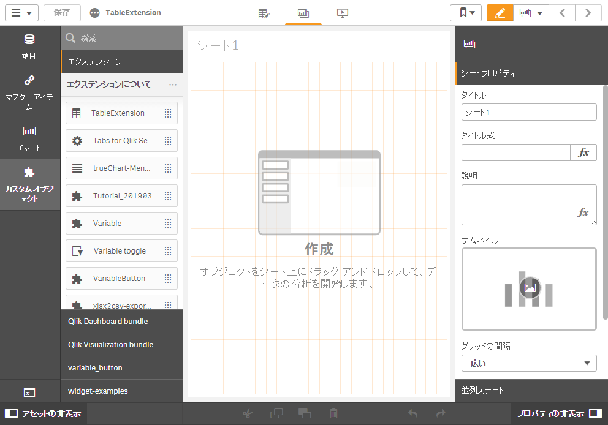
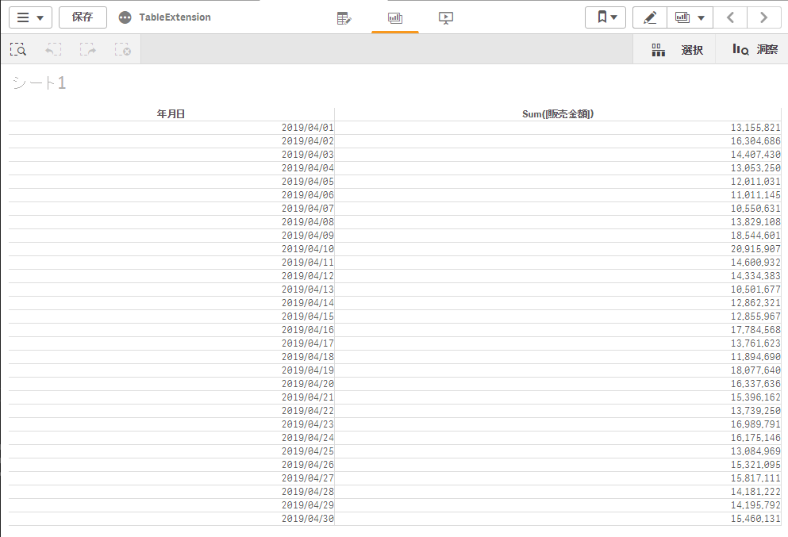

このページで使うqvfファイルを [ダウンロード]()

# まずはカスタマイズしないで使ってみる

Qlik Senseでサンプルアプリを開き、編集モードに切り替えます。  
「カスタムオブジェクト→エクステンション」から作成したエクステンションを探し、シートに追加します。

軸に「`年月日`」を追加します。  
数式に「`Sum(販売金額)`」を追加し、書式設定を「`1,000`」とします。

`年月日`を軸として`販売金額`が集計されましたが、いくつかの機能が足りていません。  
- 軸`年月日`をクリックしても項目が選択されない
- セルの背景色が設定できない
- スタイルが適用されておらず、チャートにおしゃれ感が足りない

エクステンションを編集して足りない機能を追加してゆきましょう。