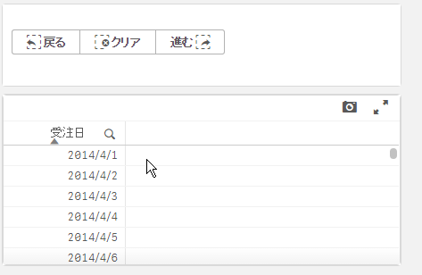

このページで作成するファイルを[ダウンロード](https://github.com/ISLdekura/QsExtensionTutorialSite/tree/master/Working_Extension/2_2)

# 戻る・進む・選択のクリアボタンを表示する

引き続き、「戻る」・「進む」・「選択をクリア」するボタンのエクステンションを作成しましょう。  
シート一覧を表示する機能を作成したときと同様にここでも新しいエクステンションを作成します。  
エクステンション名は `Navigation_Button` とします。

jsファイルを開き、以下のように編集します。  
オブジェクトに表示するボタンは固定のため、テンプレートにHTMLを記入することで見通しよく記述できます。
ボタンが押されたときの処理はコントローラーに記述し、それぞれの関数がQlik Senseの `app` APIを呼び出して状態遷移を実現しています。
jsファイル全体をサンプルコードで置き換えてください。

```js
'use strict';
define( [ "qlik"
],
function (qlik) {
	return {
		support : {
			snapshot: true,
			export: true,
			exportData : false
		},
		template: `
		<div class="lui-buttongroup">
			<button class="lui-button" ng-click="back()">
				<span class="lui-icon lui-icon--selections-back"></span>
				戻る
			</button>
			<button class="lui-button" ng-click="clear()">
				<span class="lui-icon lui-icon--clear-selections"></span>
				クリア
			</button>
			<button class="lui-button" ng-click="forward()">
				進む
				<span class="lui-icon lui-icon--selections-forward"></span>
			</button>
		</div>
		`,
		controller: ['$scope', function( $scope ) {
			$scope.back = function(){
                // 選択を戻る
				const app = qlik.currApp();
				app.back();
			}

			$scope.forward = function(){
                // 戻した選択をやり直す
				const app = qlik.currApp();
				app.forward();
			}

			$scope.clear = function(){
                // 選択をクリア
				const app = qlik.currApp();
				app.clearAll();
			}
		}]
	};
});
```

エクステンションの見た目・動作は以下のようになります。  
各ボタンをクリックすることで選択状態の遷移ができています。  
  
ボタンの色や表示されているアイコンを変更したい場合は [Leonardo UI](https://qlik-oss.github.io/leonardo-ui/icons.html) のドキュメントを参考にHTML部分を書き換えてみましょう。
